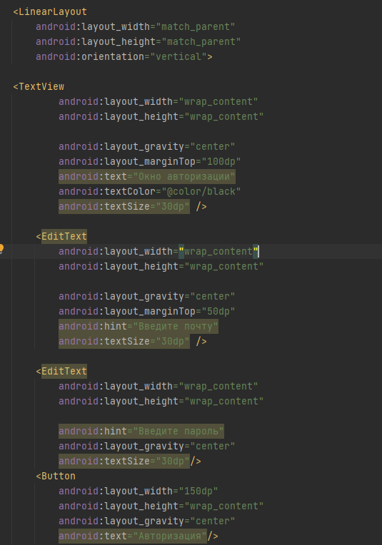
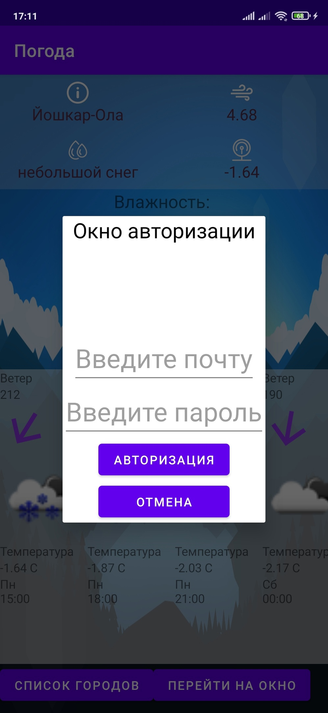
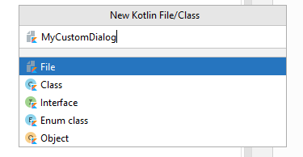
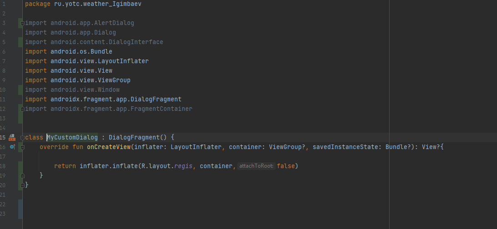

# Создание AltertDialog для авторизации пользователя
 
## Пользовательский диалог
Наиболее гибким способом создания диалога является не использование класса andorid.app.Dialog, а использование класса **DialogFragment.** Благодаря этому вы получаете полную возможность фрагментации, включая возможность наблюдать жизненный цикл диалога, а также использовать ViewModels.
Что такое DialogFragment?
Фрагмент DialogFragment — это фрагмент, который отображает диалоговое окно, плавающее поверх окна его активности. Этот фрагмент содержит объект Dialog, который он отображает по мере необходимости в зависимости от состояния фрагмента.

Наша реализация будет переопределять этот класс и реализовывать
**onCreateView(LayoutInflater, ViewGroup, Bundle)** для предоставления содержимого диалога. В качестве альтернативы мы можем переопределить onCreateDialog(Bundle) для создания полностью пользовательского диалога, например AlertDialog, с собственным содержимым.

## Создание макета для AlertDialog

Для создания внешнего интерфейса нашего AlertDialog нужно создать новый Layout,

 в новом Layout создаём кастомный интерфейс для AlertDialog:





## Создание класса "Dialog"

Теперь нам нужно создать класс который будет наследником **DialogFragment**:



Теперь в этом классе нам нужно реализовать вышеупомянутый **onCreateView**:


## Реализация кнопок
Добавим обработчик для кнопки перехода на окно авторизации в главном окне:
```
fun select(view: View) {
        MyCustomDialog().show(supportFragmentManager, "Dialog")
    }
```
Далее при нажати по кнопке "Авторизация" должен производиться пост-запрос на сервер:

Создание лямбды-функции:
```
 private lateinit var getServer:(result:String, error: String) -> Unit


   getServer = {result, error ->
                //Тут должен быть запрос на сервер
            }
 ```


    