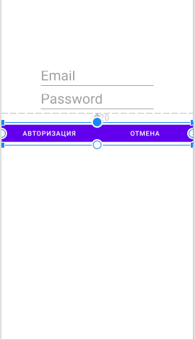

# Создание AltertDialog для авторизации пользователя
 
## Пользовательский диалог
Создать  пользовательский AlertDialog можно с помощью класса **DialogFragment** - он является подклассом класса Fragment. DialogFragment имеет собственный жизненный цикл, аналогичный фрагменту.

DialogFragment должен гарантировать, что то, что происходит с состояниями Fragment и Dialog, остается согласованным. Для этого он следит за тем, чтобы исключить события из диалогового окна, и заботится об удалении своего состояния, когда они происходят.

## Создание макета для AlertDialog

1. Для создания внешнего интерфейса нашего AlertDialog нужно создать новый Layout:

Далее создаём разметку, для примера я взял готовый макет:

2. Теперь нам нужно создать класс который будет наследником **DialogFragment**:

